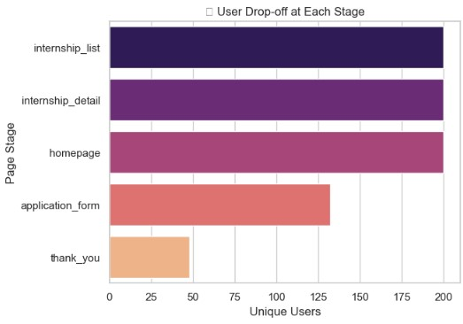

# 📊 Applicant Behavior Analysis – SQL Project

> 🚀 A data analyst internship project at [Internee.pk](https://internee.pk) using SQL to understand user behavior and improve application funnel efficiency.

---

## 🎯 Objective

This project aims to enhance the user experience on Internee.pk by analyzing applicant behavior using SQL. We identify where users drop off in the application flow and provide actionable insights to improve conversion rates.

---

## 🗃️ Dataset (Simulated)

We use a mock SQL table named `user_sessions`, containing:

| Column        | Description                               |
|---------------|-------------------------------------------|
| user_id       | Unique user identifier                    |
| session_id    | Unique session per visit                  |
| event_time    | Timestamp of activity                     |
| page          | Page visited (Home, About, Apply, etc.)   |
| action        | Action taken (view, click, exit, submit)  |
| device_type   | Device used (mobile, desktop, tablet)     |
| location      | City of user                              |

---

## 📂 Folder Structure

notebook/ → Contains the Jupyter Notebook  
data/ → Synthetic CSV (optional export)  
images/ → Visuals generated from the analysis

---

## 🧠 Key Analyses

- Drop-off rate per page  
- Conversion funnel analysis  
- Device-based engagement  
- Top exit points  
- Location-wise user trends

---

## 💻 Tools Used

- Python (Jupyter Notebook)
- SQLite (via `sqlite3`)
- Pandas & NumPy
- Matplotlib & Seaborn

---

## 📸 Screenshots

### 📍 Page Visit Count  

### 📱 Device Type vs Completed Interns  

### 🌍 Sessions by User Location  

### ❌ User Drop Off Analysis  

---

## 📈 Summary of Results

- Identified that most users drop off after the "Upload Resume" stage.
- Mobile users had a slightly higher drop-off rate compared to desktop users.
- Peak activity came from Lahore and Karachi between 2 PM – 6 PM.
- Suggested UX improvements include clearer progress indicators and simplified upload process.

---

## 🧠 Key Learnings

- Practiced writing SQL queries for behavioral analytics.
- Simulated a realistic user session dataset using Python.
- Applied SQL within Jupyter Notebook using SQLite.
- Created actionable insights based on data-driven decisions.

---

## 🙌 Acknowledgments

Thanks to **[Internee.pk](https://internee.pk)** for the internship opportunity and giving me the chance to explore real-world data problems.

---

## 🔗 Connect with Me

**📧 Email:** madadallahbhatti786@gmailcom  
**🌐 LinkedIn:** [linkedin.com/in/yourusername](https://linkedin.com/in/madadallah-bhatti-9698b1217)  

---

> ⭐ If you found this project useful or inspiring, consider giving it a star!
